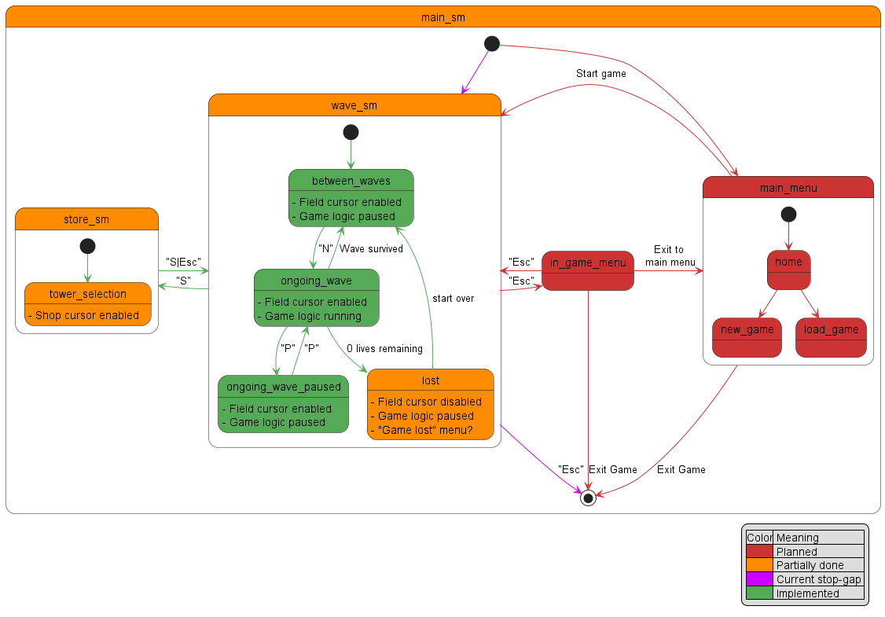

# Untitled Tower Defense Game

## Controls
- D-pad or `2`, `4`, `6`, `8` to move cursor (`4` = `left`, `8` = `up`, `6` = `right`, `2` = `down`)
- `enter`, `space` or `5` to place a tower
- `N` to spawn the next wave
- `P` to pause the game
- `Esc` to quit the game

## Installation
[Ndless](https://github.com/ndless-nspire/Ndless) needs to be installed and activated for the executable to run. 
After that, use the [TI-Nspire Computer Link](https://education.ti.com/en/products/computer-software/ti-nspire-computer-link) software to transfer the executable.

## Disclaimer
This project started life over half a decade ago, so you'll have to excuse past me's coding skills.  
Most of the time since it has either spent on the backburner or being rewritten due to me learning new things, so the project is still pretty bare-bones.

## Concept
Think a simplified Bloons Tower Defense 5, but with more resource management (wood, stone, etc.). And it runs on a calculator.

## Internal state machine

